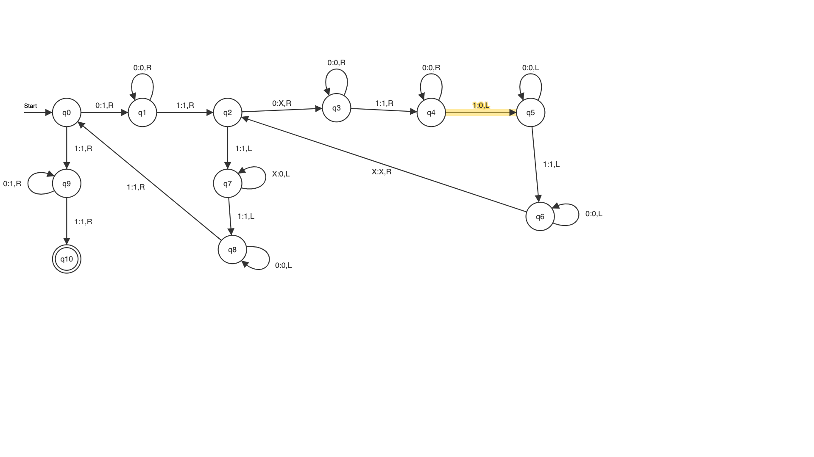

## Machine

## Unary encoding
### States
- q0: 0
- q1: 00
- q2: 000
- ..

#### Start state
- Start state: 0 = false, 00 = true

#### Final state without transitions
- consist only of ID without transition encoding
Example: final state q2 without transitions = 110001011

### Tape symbols
- 0: 0
- 1: 00
- X: 000

### Movement
- Left: 0
- Right: 00

### Transitions
Syntax:
(current_state, read_symbol) -> (next_state, write_symbol, movement)

=> current_state1read_symbol1next_state1write_symbol1movement1start_state1final_state
=> transition11transition11...111input

Examples:
- (q1, 0) -> (q3, 0, R) = 010100010100
- (q2, 0) -> (q3, X, R) = 001010001000100

### Input
- 1 = separator for multiplication
- 11 = separator for transitions
- 111 = separator of transitions & input

Example: 2 · 4 = 0010000

=> transitions111x1y
